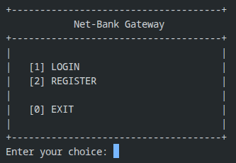
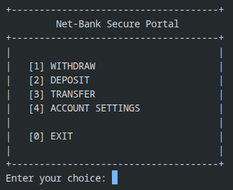
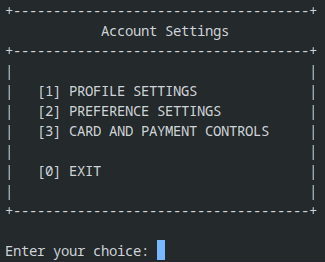

# cBankSim

A terminal-based and local spin-off of how banks operate, purely coded in C.

## Description

Since it is purely coded in C. It is mostly **terminal-based** due to GUI limitiations on a language like C. However, the terminal still provides a decent UI/UX experience with a simple and neat generic format design and a delay between operations.

### Whats inside of the bank

At the current version **(V1)**, it contains pretty basic bank operations like **ATM Operations** *(Withdraw, Deposit, & Transfer)*. Along with a few features in **Account Management** like `Change User Credentials`, `Set Notifs and Alerts`, as well as `Inbound and Outbound balance limiting` for basic standard bank operations

*Here's a few picture for reference:*

1. **Login Menu Screen (Initial System Menu)**

    

This is what you will see everytime you run the code, the system will always require you to login like how every bank does.

2. **Main Menu Screen (After Logging In)**

    

The main menu where you will spend most of the time whether it is checking if my code runs or trying what each feature does.

3. **Account Management Settings (UAS Menu)**

    

This is menu can be found in the 4th selection in the main menu and this is the goto for changing credentials, setting up notif flags or limits.

There are also more menus but this is basically just the **three core menus** you will stumble upon interacting with this terminal.

## How to's

If you are asking on how can i check if this code runs without having to pull? **Sadly, you can't but it will be a feature that will later on be implement *on or before* V2 comes**, so you will have to wait for future updates in-order to check it out.

Alternatively, you can fork the repository and run it directly using an IDE like **VSCode** or a scripting terminal *(like Bash or Shell)* and run the code with `Makefile`

### Running the bank using *Makefile*

Running the code with Makefile is easier since it's already configured to run in a single cmd:

- `make all` - for compiling the system BUT not running it
- `make run` - for compiling the syste AND running it

Both works properly as long as there isn't any unintended code changes or implementations created locally in your respective machine. You can also run extended Makefile cmd such as:

- `make clean` - for removing the entire `.object` files
- `make memcheck` - If you somehow want to check for memory leaks. However, this is only exclusive for linux kernels as Valgrind are coded with only Linux in mind.

That's about how you run the code for now, and i know too well that it will be painful just to test it, but i can assure that an exclusive executable file is in the works and will be released soon.

## Extra Information

This repository or project is created for the sole purpose of solidifying my programing fundamentals in my fundamental and first language/tool which is `C Language`. I also never thought that i would go on to create a bank and implement some of the feature i still cant quite wrap my head around for.

But as you're reading this, it is probably already published into production. And this will provide a baseline for my future projects, and i do have a passion now on recreating existing wheels just to understand how logical computers work.

And kudos for you for reading this up until now, i appreciate spending time skimming through this repository whether you are an interviewer OR someone who just stumbled upon or referred to for this repository. 

---
_End of README_